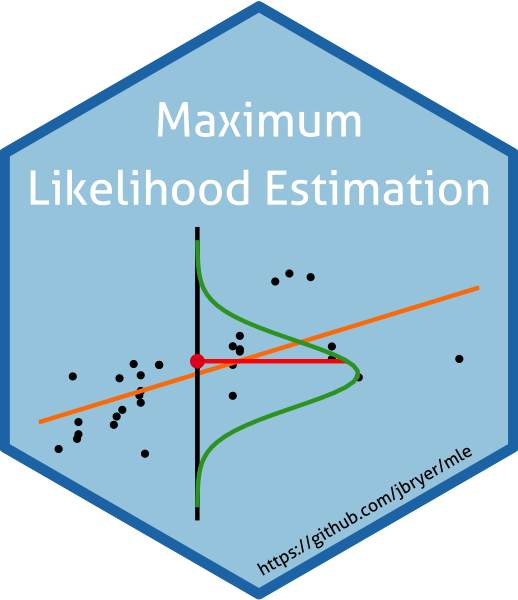
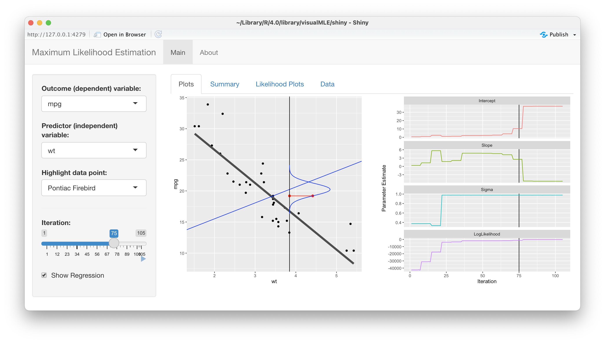

# Visual Introduction to Maximum Likelihood Estimation

<a href='https://github.com/jbryer/visualMLE'></a>


**Author:** Jason Bryer, Ph.D. jason.bryer@cuny.edu  
**Website:** https://github.com/jbryer/visualMLE


[Visual Introduction to Maximum Likelihood Estimation](https://htmlpreview.github.io/?https://github.com/jbryer/visualMLE/blob/master/doc/mle.html)  
[The Path to Log Likelihood](https://htmlpreview.github.io/?https://github.com/jbryer/visualMLE/blob/master/doc/log_likelihood.html)

To install the package, run:

```
remotes::install_github('jbryer/visualMLE')
vignette('mle', package = 'visualMLE')
```

To run the accompanying shiny app, execute the following command:

```
visualMLE::shiny_mle()
```



----------

*Acknowledgments:* Thanks to [Bruce Dudek](https://www.albany.edu/psychology/statistics/shinypsych.htm) for comments and suggestions and to [Jorge Cimentada's](https://cimentadaj.github.io) [blog post](https://cimentadaj.github.io/blog/2020-11-26-maximum-likelihood-distilled/maximum-likelihood-distilled/) that inspired me to build this shiny application.
